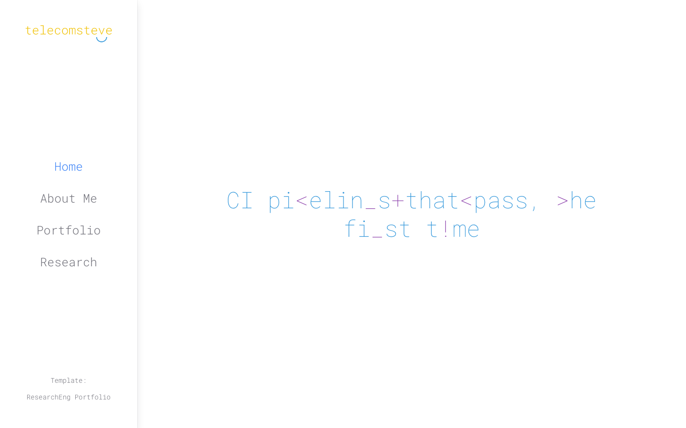
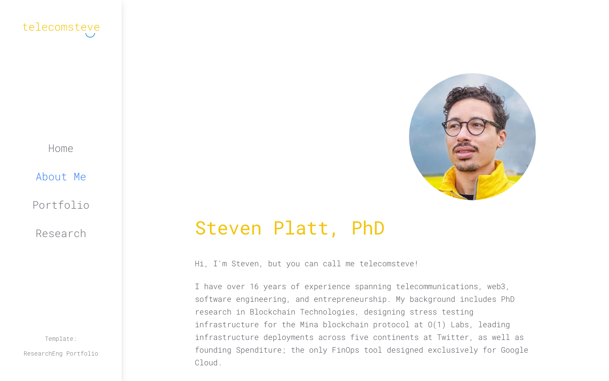
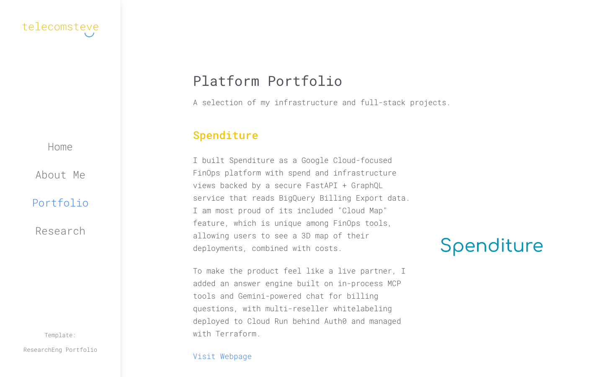
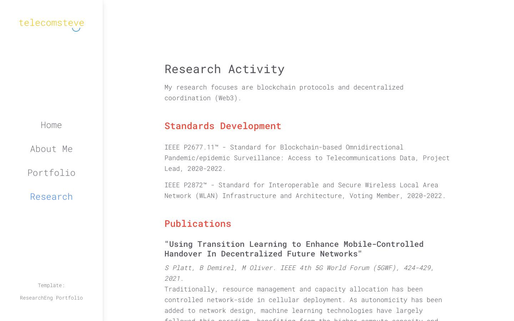
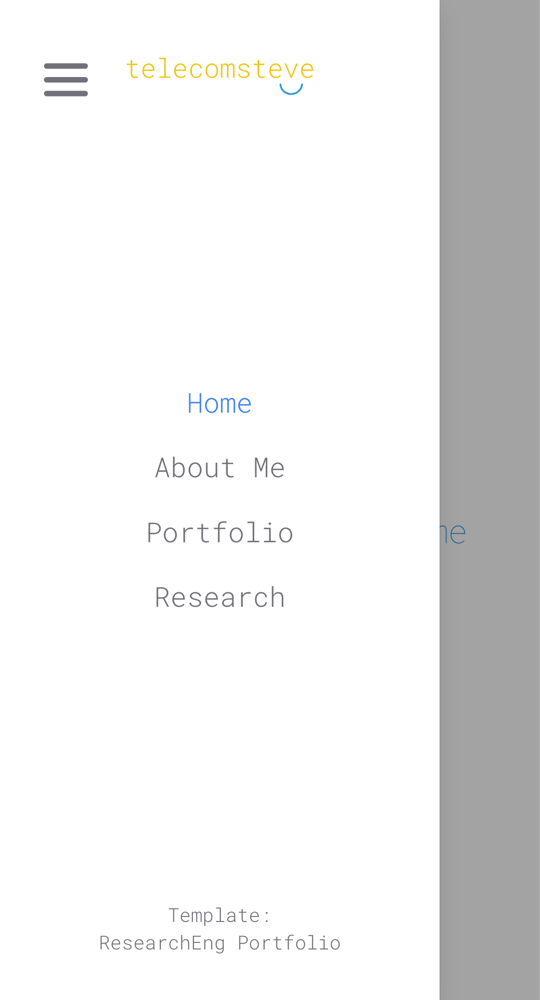

# telecomsteve

[](https://github.com/stevenplatt/telecomsteve/actions/workflows/ci.yml)
[](https://github.com/stevenplatt/telecomsteve/actions/workflows/ci.yml)

Source code for [telecomsteve.com](https://telecomsteve.com), the personal
portfolio site of Steven Platt (telecomsteve). The site introduces Steven and
his background, and presents:

- **Home** — an animated text-scramble hero cycling through platform
  engineering themes.
- **About Me** — bio, areas of expertise, work experience (Spenditure, o1Labs,
  Twitter, and more), technical skills, and education.
- **Portfolio** — selected platform and full-stack projects, including
  [Spenditure](https://spenditure.com) and [Yoptio](https://yoptio.com).
- **Research** — standards work, peer-reviewed publications, and invited talks
  from Steven's PhD research in blockchain technologies.

Built with React 19, TypeScript, Vite, and Chakra UI. The app lives in the
[`telecomsteve/`](telecomsteve/) directory.

## Screenshots

| Home | About Me |
| --- | --- |
|  |  |

| Portfolio | Research |
| --- | --- |
|  |  |



## Getting started

```bash
cd telecomsteve
npm install
npm run dev
```

Then open http://localhost:5173.

## Scripts

Run these from the `telecomsteve/` directory:

| Command | Description |
| --- | --- |
| `npm run dev` | Start the dev server |
| `npm run build` | Type-check and build for production |
| `npm run lint` | Lint the code |
| `npm test` | Run unit tests (Vitest) |
| `npm run coverage` | Run unit tests with the enforced 100% coverage gate |
| `npm run test:e2e` | Run end-to-end tests (Playwright, desktop + mobile) |
| `npm run verify` | Lint, type-check, unit test, and build |

## Testing and CI

Unit tests run under Vitest with **100% coverage enforced** — the thresholds in
[`telecomsteve/vite.config.ts`](telecomsteve/vite.config.ts) fail the run if
statement, branch, function, or line coverage drops below 100%. Playwright
covers end-to-end flows in both desktop and mobile viewports.

The [CI workflow](.github/workflows/ci.yml) runs a security audit (`npm audit`
fails the build on a vulnerability of any severity), lint, the unit-test
coverage gate, a production build, and the e2e suite on every push and pull
request.
The coverage job is the required status check that will gate code deployment
once a deploy workflow is added.
